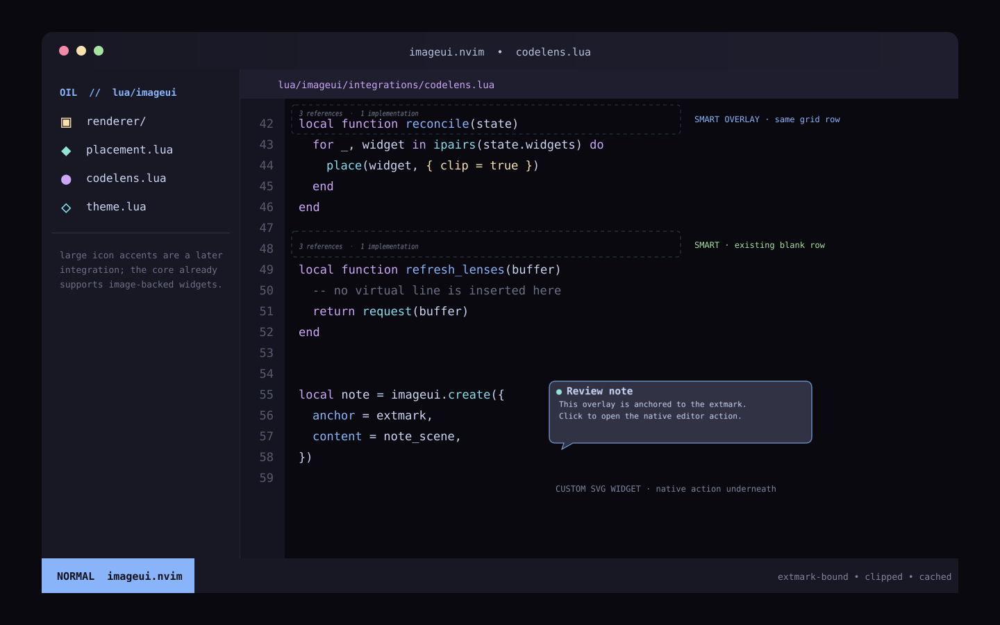
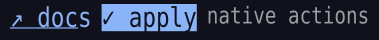

# imageui.nvim

`imageui.nvim` is an experimental image-decoration framework targeting Neovim 0.13/nightly. It binds PNG
overlays to buffers, windows, the cursor, or the editor grid, keeps them synchronized while the
UI moves, and renders theme-aware text through SVG when ordinary terminal cells are too limiting.

The first integration replaces full-height LSP CodeLens virtual lines with small transparent text.
The core is intentionally generic enough for icons, notes, tooltips, Markdown accents, diagnostics,
and other image-backed widgets.

ImageUI is an enhancement layer, not a replacement GUI. Neovim remains authoritative for buffers,
windows, borders, focus, cursor movement, selection, scrolling, and editing. ImageUI contributes the
details a terminal grid cannot express well: smaller or larger text, larger glyphs, sub-cell spacing,
transparent accents, and image detail. A native window can host a surface, but ImageUI never closes,
hides, or restyles that window.



> [!IMPORTANT]
> Neovim's `vim.ui.img` API is experimental. ImageUI uses the same Kitty graphics transport and
> capability probe, but pools uploaded PNG assets separately from their screen placements. It works
> with compatible terminals such as WezTerm and Kitty, including WezTerm through tmux passthrough,
> but not external UIs such as Neovide.

## Requirements

- A Neovim build exposing `vim.ui.img` (currently 0.13/nightly; 0.12 can load/test the framework
  with an injected backend but does not provide native terminal images).
- A terminal implementing the Kitty graphics protocol. Run `:checkhealth imageui`.
- One SVG rasterizer: `resvg`, Inkscape, `rsvg-convert`, or ImageMagick.
- ImageMagick (`magick` or `convert`) for true partial clipping around window edges and floats.
- Explicit terminal font and cell metrics for the closest text match. Neovim cannot discover these.

When Neovim runs inside tmux 3.3 or newer, enable passthrough once in `~/.tmux.conf`:

```tmux
set -g allow-passthrough on
set -g focus-events on
```

Apply it to the running server with `tmux set -g allow-passthrough on`, run `:ImageUI reset`, then run
`:checkhealth imageui`. The default `transport.tmux = "auto"` detects `$TMUX`, verifies the effective
pane option, and translates Neovim screen cells through the current pane origin, tmux window
viewport, and top status line. Each projected cursor move and Kitty placement crosses tmux in one
passthrough envelope, so the outer terminal cannot anchor it at tmux's last paint cursor. Warm
placement moves from one editor frame are coalesced and share one bounded passthrough envelope;
PNG upload chunks remain separate. Use `"off"` only to disable wrapping or `"on"` to force it when
the tmux option cannot be queried.
After enabling `focus-events`, detach and reattach existing tmux clients. ImageUI pauses new image
writes while its pane is unfocused and replays retained placements when focus returns without
re-uploading PNGs. `:checkhealth imageui` reports the resolved outer-terminal origin and whether the
active tmux client advertises synchronized updates. If it does not, health prints the exact
`terminal-features` line appropriate to that client's `$TERM`. A tmux session attached to multiple
clients can have different origins; only one attached client geometry can be targeted reliably.

The experimental native API is deliberately small:

```lua
local id = vim.ui.img.set(png_bytes, {
  row = 12,       -- one-based global screen row
  col = 8,        -- one-based global screen column
  width = 10,     -- grid cells
  height = 1,     -- grid cells
  zindex = 50,    -- relative to other images
})
vim.ui.img.set(id, { row = 13, col = 8 }) -- update
local placement = vim.ui.img.get(id)
vim.ui.img.del(id)
```

It also combines image upload and placement creation. Repeated offscreen deletion/re-entry can
therefore retransmit PNGs and leave soft-deleted image data in terminal scrollback. ImageUI's
default pooled backend uploads each unique rendered asset once, creates any number of placements,
and reuses dormant placement IDs. New assets are admitted only while the configured decoded-byte
and asset-count budgets can be maintained; otherwise the widget uses its normal fallback. Extmark
binding, clipping, SVG support, and interaction remain independent plugin modules.

## Installation

With lazy.nvim:

```lua
{
  "yourname/imageui.nvim",
  version = false, -- vim.ui.img is currently available on Neovim nightly
  opts = {
    style = {
      font_family = "JetBrainsMono Nerd Font",
      cell_width = 9,
      cell_height = 18,
    },
    integrations = {
      codelens = {
        enabled = true,
        layout = "smart",
      },
    },
  },
}
```

For a local checkout:

```lua
{
  dir = "/absolute/path/to/imageui.nvim",
  opts = {
    integrations = { codelens = { enabled = true } },
  },
}
```

Run `:checkhealth imageui`, followed by `:ImageUI demo` to verify rendering.

## CodeLens behavior

The integration replaces only Neovim's private visual provider. It keeps the public
`vim.lsp.codelens` surface as the source of truth: `enable()`, `is_enabled()`, `get()`, `run()`,
the deprecated `refresh()`, `workspace/codeLens/refresh`, and the default `grx` mapping all use the
same lenses shown by ImageUI. The original functions and per-buffer enabled state are restored when
the integration is unloaded. This avoids two independent CodeLens systems or commands that can see
one renderer but not the other.

Three layouts are available:

| Layout | Behavior |
| --- | --- |
| `smart` | Uses the lower portion of an existing blank row above the function; otherwise overlays the upper portion of the function row. |
| `overlay` | Always renders small text in the function's row without reserving another row. |
| `blank_line` | Only uses an existing blank row; otherwise falls back to right-aligned virtual text. |

`layout` is the compact backwards-compatible setting. For exact control, provide an ordered
`placement_order`. Each lens uses the first viable mode:

| Mode | Behavior |
| --- | --- |
| `above_blank` | Use a geometrically visible blank buffer row. Visual-only glyphs such as `'listchars'` and indent guides do not disqualify it. |
| `above_clear` | Use the row above when the image rectangle does not collide with visible text, even if that row has text elsewhere. |
| `overlay` | Draw in the function row using subcell text composition. |
| `right` | Use right-aligned virtual text without adding a row. |
| `native` | Use Neovim-style `virt_lines_above`, which reserves a visual row. |
| `hide` | Do not display a lens when earlier strategies fail. |

If an image mode fails at runtime, processing resumes at the next `right`, `native`, or `hide`
entry. An explicit order never invents a mode that is not listed. The legacy `fallback` option only
applies when `placement_order` is unset.

For example, a conservative no-overlap policy is:

```lua
placement_order = { "above_blank", "above_clear", "right", "native" }
```

The right-side label is a separate, window-aware channel. It is used by the `right` placement mode,
and it can also remain visible while an image is successfully placed above or over the function:

```lua
right = {
  always = true,          -- keep a normal-cell label as well as the chosen image/native placement
  anchor = "colorcolumn", -- "window" or the first usable window-local 'colorcolumn'
  side = "after",         -- place before or after the color column
  distance = 2,           -- empty cells between the label and its anchor
}
```

With `anchor = "window"`, `distance` is measured from the right edge and `side` is ignored. With
`anchor = "colorcolumn"`, `side = "before"` makes the label end before the guide, while
`side = "after"` starts it in the non-code area after the guide. This is resolved for each split
independently, including horizontal scrolling. If `'colorcolumn'` is unset or does not leave enough
room, that window falls back to the right edge. `always = true` is independent of
`placement_order`, so `placement_order = { "above_blank", "above_clear", "native" }` can still keep
the right-side companion visible.

Images still occupy integer cell rectangles. A half-sized CodeLens is small text inside a
transparent one-cell PNG—not a true half-height Neovim row. The result depends on terminal font and
line-height settings.

CodeLens commands remain runnable through Neovim's normal `grx` mapping, on either the function row
or the visual row above it. If mouse interaction is enabled, clicking an image executes the sole
lens or opens a selector when several exist. A language server still has to advertise and return
`textDocument/codeLens`; for example, basedpyright commonly returns none while lua-language-server
does provide reference lenses.

`:ImageUI inspect` exposes actual terminal traffic under `performance.transport`.
`transmissions` and `transmitted_bytes` should plateau after assets warm; `places`, `updates`, and
`unplaces` are logical control operations. `send_calls`, `tmux_envelopes`, `control_batches`, and
`coalesced_control_commands` show the actual write reduction. Scheduler event-to-frame wait is under
`performance.scheduler`. `performance.backend` separately counts manager calls.

## Configuration

```lua
require("imageui").setup({
  enabled = true,

  -- "auto" uses the pooled Kitty transport. "nvim_img" is the unpooled
  -- compatibility adapter. A backend table can be injected for tests.
  backend = "auto",

  transport = {
    tmux = "auto", -- auto | on | off; an edge transport concern only
    -- WezTerm currently needs delete-before-replace during scrolling to avoid
    -- an upstream Kitty-placement renderer crash. auto enables it only there.
    safe_reposition = "auto", -- auto | on | off
  },

  placement = {
    clip = "window",       -- window | editor | none
    partial = "clip",      -- clip | hide | allow
    occlusion = "clip",    -- clip | hide | allow
    zindex = 50,
    debounce = 16,
    scroll_debounce = 32, -- maximum wait for the next continuous-scroll frame
    max_fragments = 8,
  },

  render = {
    rasterizer = "auto",   -- resvg | inkscape | rsvg-convert | magick | convert
    timeout = 5000,
    max_jobs = 4,          -- global SVG/crop child-process limit
    max_queue = 256,       -- hard cap for pending child-process work
    scale = 2,              -- supersampling factor
    cache = {
      max_entries = 256,
      max_bytes = 64 * 1024 * 1024, -- approximate decoded terminal asset budget
      directory = vim.fs.joinpath(vim.fn.stdpath("cache"), "imageui"),
    },
  },

  style = {
    font_family = "monospace",
    font_file = nil,
    cell_width = 9,
    cell_height = 18,
    box_chars = nil,
  },

  interactions = {
    mouse = false,
    hover = false,
  },

  integrations = {
    codelens = {
      enabled = false,
      layout = "smart",       -- smart | overlay | blank_line
      -- Optional ordered replacement for layout:
      placement_order = nil,  -- above_blank | above_clear | overlay | right | native | hide
      font_scale = 0.52,
      position = "top",       -- top | center | bottom
      offset_row = 0,
      offset_col = 0,
      separator = "  ·  ",
      highlight = "LspCodeLens",
      separator_highlight = "LspCodeLensSeparator",
      fallback = "virtual_text", -- legacy layout failure fallback; ignored by placement_order
      relayout_debounce = 50, -- throttle collision scans during continuous scrolling
      right = {
        always = false,       -- also show at right when an image/native mode succeeds
        anchor = "window",    -- window | colorcolumn
        side = "before",      -- before | after; used with colorcolumn
        distance = 2,
      },
      debounce = 250,
      refresh_on_change = true,
      refresh = { "LspAttach", "BufEnter", "BufWritePost" },
    },
  },
})
```

Mouse mappings are opt-in. They are installed only when `<LeftMouse>` has no existing mapping; the
plugin will not silently replace a user's mapping.

## Public API

```lua
local imageui = require("imageui")

local id = imageui.create({
  tag = "note",
  anchor = {
    kind = "buffer",
    buffer = 0,
    row = 20, -- zero-based buffer row
    col = 4,  -- zero-based byte column
  },
  offset_row = 0,
  offset_col = 0,
  content = {
    kind = "text",
    highlight = "Comment",
    font_scale = 0.6,
    position = "top",
    spans = {
      { text = "external note", highlight = "DiagnosticInfo" },
    },
  },
  actions = {
    click = function(widget_id, mouse)
      vim.notify("clicked " .. widget_id)
    end,
  },
})

imageui.update(id, { offset_col = 2 })
imageui.delete(id)
imageui.clear({ tag = "note" })
imageui.invalidate_styles() -- force an immediate full style rebuild when needed
imageui.reset_transport()   -- re-upload after an external terminal image reset

local unsubscribe = imageui.on_redraw("my-integration", function()
  -- Re-evaluate integration-specific layout after Neovim composes a window.
end)
-- unsubscribe()
```

Supported anchors:

- `buffer`: extmark-backed; `row` and `col` are zero-based, and one image is created for every
  visible current-tab window showing the buffer.
- `window`: zero-based row/column offsets from a window's screen position. Set
  `origin = "content"` to start after its border, number/fold/sign columns, and winbar.
- `cursor`: zero-based offsets from the cursor's resolved screen cell.
- `screen`: one-based global `row` and `col`, matching `vim.ui.img`.

Raw PNGs can bypass SVG rendering:

```lua
imageui.create({
  anchor = { kind = "screen", row = 4, col = 10 },
  content = {
    kind = "png",
    path = "/path/to/icon.png",
    width_cells = 3,
    height_cells = 2,
    pixel_width = 54,  -- required for partial clipping
    pixel_height = 72,
  },
})
```

Custom SVG scenes are also supported. `source` may be an SVG string or a function receiving the
resolved theme styles and cell metrics:

```lua
content = {
  kind = "svg",
  width_cells = 24,
  height_cells = 5,
  highlights = { "NormalFloat", "FloatBorder", "Title" },
  source = function(ctx)
    return make_note_svg(ctx.styles, ctx.cell_width, ctx.cell_height)
  end,
}
```

Widget specs may also define `fallback(id, error)`, `on_render(id, asset, window)`, and
`on_show(id, asset, window, rectangle)`, `on_hide(id, window, rectangle)`, and `on_delete(id)`
callbacks. Callback failures are isolated and reported by `:ImageUI inspect` instead of
interrupting redraw.

### Declarative scenes and surfaces

`imageui.surface()` adds semantic layout, per-element interaction regions, and explicit focus on top
of the widget core. The scene remains data; callbacks live in the surface action table and are never
stored in the shared raster cache.



```lua
local scene = imageui.scene

local surface = imageui.surface({
  anchor = { kind = "buffer", buffer = 0, row = 20, col = 4 },
  appearance = "inline",
  scene = scene.row({
    gap = 0.5,
    children = {
      scene.text({
        id = "docs",
        text = "󰋖 docs",
        role = "link",
        font_scale = 0.68,
        focusable = true,
        states = { focused = { role = "selection", background = true } },
      }),
      scene.text({
        id = "apply",
        text = "󰄬 apply",
        role = "muted",
        font_scale = 0.68,
        focusable = true,
        states = { focused = { role = "selection", background = true } },
      }),
    },
  }),
  focus = { order = { "docs", "apply" }, initial = "docs", wrap = true },
  actions = {
    docs = {
      click = open_docs,
      activate = open_docs,
      consume = false, -- also replay the native click for cursor/selection behavior
    },
    apply = { click = apply_action, activate = apply_action },
  },
})

surface:focus_next()
surface:focus_prev()
surface:focus("apply")
surface:activate()
surface:update({ scene = next_scene })
surface:close()
```

The initial scene primitives are `text`, `row`, `column`, `stack`, `box`, and `spacer`. Layout values
such as `font_scale`, `gap`, padding, and spacer dimensions may be fractional cells. The final image
still occupies integer cells. Mouse input from Neovim is cell-resolution, so a visual region is
rounded outward to the smallest covering cell rectangle. An explicit `hit_rect` uses integer cells;
`pointer = "none"` makes a node visual-only. Transparent space with no semantic region passes through.

Actions support `click`, `activate`, `enter`, `hover`, `leave`, `focus`, and `blur`. Mouse mappings
remain opt-in through `interactions.mouse`/`interactions.hover`, and ImageUI does not install keyboard
focus mappings. An integration chooses its own keys and calls the surface methods. `consume = false`
is the bridge for visual enhancements over editable content: the action runs, then Neovim's original
`<LeftMouse>` behavior continues.

`appearance = "inline"`, `"float"`, or `"menu"` selects semantic Neovim highlight roles. Nodes may
also use roles such as `selection`, `cursorline`, `menu_selected`, `muted`, `link`, `codelens`, and the
diagnostic roles. Raw colors remain an escape hatch; highlight groups are the normal styling API.

To enhance content inside an existing native float, use a non-owning host and omit `anchor`:

```lua
local surface = imageui.surface({
  host = { kind = "window", win = native_float },
  scene = scene.text({ id = "hint", text = "smaller native hint", role = "muted" }),
})
```

The anchor begins at the float's native content origin. Closing the surface leaves the float intact;
closing the float releases the surface. `{ kind = "view" }` is the default host and creates one
independent placement/interaction projection in every split displaying a buffer anchor.

`imageui.hit_target(screen_row, screen_col)` returns the semantic `surface_id`, `node_id`, owning
window, visible rectangle, and zero-based local cell. `imageui.hit_test()` remains the compatibility
API that returns the topmost raw widget.

## Commands

- `:ImageUI inspect`
- `:ImageUI refresh`
- `:ImageUI clear`
- `:ImageUI demo`
- `:ImageUI reset`
- `:ImageUI benchmark start [count]`
- `:ImageUI benchmark report|stop`
- `:ImageUI export [directory]`
- `:ImageUI enable|disable`
- `:ImageUI codelens enable|disable|toggle|refresh|run|inspect`
- `:ImageUI health`

`export` writes each widget's source assets and any cropped PNGs currently sent as active views,
which makes visual calibration and bug reports reproducible.

`reset` clears and rebuilds ImageUI's private terminal asset pool. Use it if another program clears
all Kitty images or after a terminal reset; UI reattachment triggers the same recovery automatically.

`benchmark start` creates the same 12 buffer-bound, CodeLens-shaped text widgets used by the stress
suite. A larger requested count is distributed through the current buffer, so
`:ImageUI benchmark start 1000` can exercise cold scrolling in a sufficiently large file. After the
ready notification, scroll normally and run `benchmark report`. A stable warm run has zero delta
for `transport.transmissions`, `transport.transmitted_bytes`, renderer jobs, and crop jobs;
placement control counts may increase. The report also includes queue activity, Lua/RSS deltas, and
reconcile and scheduler-wait measurements. `benchmark stop` reports once more and removes the
fixture.

## Architecture

```text
integrations/codelens.lua  LSP producer and native fallback
manager.lua                widget registry, redraw synchronization, reconciliation, hit testing
surface.lua                passive/non-owning surface handles, focus, semantic action lifecycle
scene/                     validated layout tree, material dependencies, SVG display list
interaction_geometry.lua   pixel-to-cell hitboxes and split/crop projection
anchor.lua                 extmark/window/cursor/screen anchors
placement.lua              viewport clipping, popup/float occlusion, fragments
renderer/svg.lua           pure theme-aware SVG text scenes
renderer/rasterizer.lua    async conversion, deduplication, bounded memory index
renderer/crop.lua          cached partial PNG crops
renderer/jobs.lua          bounded SVG/crop subprocess queue
theme.lua                  effective Normal/NormalNC/NormalFloat styles and fingerprints
backend/kitty_pool.lua     pooled Kitty image assets and reusable placements
backend/nvim_img.lua       unpooled vim.ui.img compatibility adapter
```

The renderer never knows about CodeLens, and integrations use the public widget model rather than
calling the image backend. This keeps a later split into `imageui.nvim` plus integration plugins
possible without changing their data model.

The manager also installs a read-only redraw observer. Neovim redraws caused by splits, folds,
virtual lines, diagnostics, or another decoration provider are coalesced into placement checks.
Theme-aware assets are fingerprinted per window, so detected highlight-namespace and
active/inactive split transitions rerender only the affected window when a property used by the
generated pixels actually changes. `ColorScheme` and window highlight-option changes invalidate
automatically; call `imageui.invalidate_styles()` after a standalone programmatic `nvim_set_hl()`
or `nvim_win_set_hl_ns()` change that does not otherwise alter editor geometry.

## Known limitations

- `vim.ui.img` is experimental and may change before Neovim 0.13 stabilizes.
- Image placement is screen-global, so multiple attached UIs with different grids are unsupported.
- Multiple tmux clients attached to one session may have different viewport geometry; Kitty
  placements can only target the geometry of tmux's selected client reliably.
- WezTerm has an open renderer bug around replacing Kitty placements during TUI scrolling. The
  default `transport.safe_reposition="auto"` uses delete-before-replace for WezTerm while retaining
  uploaded image data; set it to `"off"` only after the terminal-side fix is installed.
- Positive image z-index is not formally related to Neovim float z-index. The compositor crops or
  hides images around detected floats and the completion popup instead.
- Conceal can make `screenpos()` differ from the visually composed text column.
- Arbitrary non-rectangular clipping is represented by up to `max_fragments` rectangular crops.
- The terminal asset pool admits assets only within `render.cache.max_entries` and the decoded-size
  estimate in `render.cache.max_bytes`. Continuously generating more unique images causes eviction
  and retransmission; a terminal may retain evicted data referenced by its scrollback until that
  scrollback is released. When active assets fill the budget, new images use their fallback until
  capacity is released.
- ImageUI can measure Lua, Neovim RSS, and protocol bytes, but a headless process cannot directly
  measure a terminal emulator's separate GPU/decoded-image allocation.
- The framework renders visual layers. Native floats should still own focus, scrolling, selection,
  and editable content for complex widgets.
- Sub-cell visuals do not imply sub-cell input. Neovim reports mouse positions in grid cells, so
  semantic targets can be no more precise than a cell without a terminal-specific input adapter.
- Focus-state changes currently swap a compiled scene asset. State variants become warm and reuse
  the pooled transport, but retained independent layers are a future optimization for highly dynamic
  panels.

## Development

```sh
NVIM_BIN=/path/to/nvim-nightly scripts/test.sh
NVIM_BIN=/path/to/nvim-nightly scripts/test-perf.sh
```

The test suite uses an injected backend and covers geometry, configuration, SVG generation,
extmark movement, real rasterization when available, widget lifecycle, hit testing, and repeated
setup teardown. The performance suite forces thousands of viewport/focus transitions, models
terminal asset retention, validates emitted Kitty commands and ID uniqueness, checks split
correctness, bounds Lua/RSS growth, and gates settled-transition p95 latency.

Regenerate the checked-in visual examples with Neovim nightly:

```sh
nvim --headless -u tests/minimal_init.lua -l scripts/render_previews.lua
```
